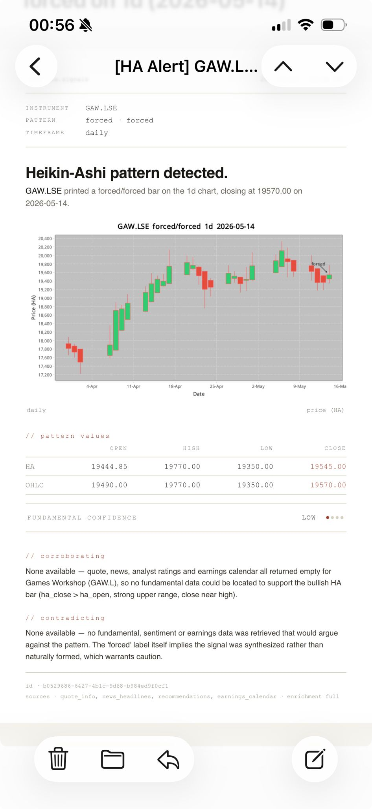

# Heikin Ashi Monitoring Service

A serverless pipeline that watches a personal watchlist of equities and emails
you a rich, AI-annotated alert whenever a stock prints a notable Heikin Ashi
candle pattern.

Every day it ingests fresh end-of-day prices, recomputes Heikin Ashi candles,
runs three pattern detectors over them, and — when a pattern fires — composes
an HTML email with an inline chart and a short fundamental-analysis note
written by Claude. It runs entirely on AWS Lambda: there is no server to keep
up and no UI to log into — the inbox *is* the interface.

## What an alert looks like



## How it works

Once a day an EventBridge cron fires the `monitoring-main` Lambda, which for
each active instrument runs four stages:

1. **Ingest** — fetch closed daily/weekly OHLC bars from EODHD, persist them
   idempotently to DynamoDB, apply the per-instrument storage policy.
2. **Heikin Ashi** — compute HA candles from the OHLC chain, deterministically
   and idempotently (`BigDecimal` arithmetic end-to-end).
3. **Detect** — evaluate three patterns (color change, strong candle, doji)
   on the freshly computed bars. Only the most recent bar can raise an alert,
   so a 250-bar first ingest doesn't trigger an alert storm.
4. **Dispatch** — for each detected event render a JFreeChart HA chart, ask
   Claude on AWS Bedrock for a fundamental-analysis note (the model pulls
   headlines from Marketaux + Yahoo Finance RSS through a tool-use loop),
   compose a multipart email and send it via SES. Failed enrichment is queued
   in DynamoDB and retried by a second Lambda every 15 minutes, degrading to a
   plain alert after three attempts.

You can also invoke `monitoring-main` manually — scoped to specific instrument
ids, or with `force_email` to smoke-test the whole chart + AI + email path
without waiting for a real pattern (see [`DEPLOY.md`](DEPLOY.md)).

## Documentation map

| Document | What it covers |
|---|---|
| [`CLAUDE.md`](CLAUDE.md) | **Authoritative behavioral specification.** Architecture decision record, single-table data model, full error catalog, per-block Gherkin scenarios, code-style rules, observability + IAM + config appendix. The source of truth for *what* the system does and *why*. |
| [`DEPLOY.md`](DEPLOY.md) | **Step-by-step deploy procedure on a fresh AWS account.** Day-0 async prereqs (SES production access, Bedrock model access), bootstrap apply, GitHub repo variables, sender-email secret, first push, verification, common snags, rollback. Also contains the **"Adding an instrument"** recipe (raw `aws dynamodb transact-write-items` until the `mon` CLI lands). |
| [`terraform/bootstrap/README.md`](terraform/bootstrap/README.md) | Bootstrap stack reference: state bucket, lock table, GitHub OIDC provider, deploy IAM role + trust policy. Applied once per account, manually. |
| [`terraform/main/README.md`](terraform/main/README.md) | Main stack reference: per-file resource catalog, the code-vs-shape deploy model and `lifecycle { ignore_changes }` rationale, manual prerequisites, ops notes. |
| [`THIRD_PARTY_LICENSES.txt`](THIRD_PARTY_LICENSES.txt) | Auto-generated full enumeration of every direct + transitive Maven dependency with licenses. Refreshed on every `mvn verify`. |
| [`LICENSE`](LICENSE) | BSD-0 project license + third-party license families summary. |
| [`context-diary/`](context-diary/) | Periodic handoff snapshots intended for fresh agent/session pickup. |

## Stack

| Layer            | Choice                                                   |
|------------------|----------------------------------------------------------|
| Language         | Java 25 (Amazon Corretto)                                |
| Framework        | Micronaut 4.10.x                                         |
| Build            | Maven                                                    |
| Compute          | AWS Lambda (JVM + SnapStart, arm64)                      |
| Database         | DynamoDB single-table, on-demand                         |
| Market data      | EODHD end-of-day API (behind a `MarketDataProvider` port)|
| News             | Marketaux + Yahoo Finance RSS (aggregated + deduplicated)|
| AI               | AWS Bedrock + Claude (Converse API, manual tool loop)    |
| Charting         | JFreeChart (headless)                                    |
| Email            | Apache Commons Email + SES v2 raw send                   |
| IaC              | Terraform                                                |
| CI/CD            | GitHub Actions (OIDC to AWS)                             |

## Repository layout

```
.
├── CLAUDE.md                       # authoritative specification
├── DEPLOY.md                       # step-by-step deploy runbook
├── README.md                       # you are here
├── LICENSE                         # BSD-0 + third-party summary
├── THIRD_PARTY_LICENSES.txt        # full dep enumeration (auto-generated)
├── pom.xml                         # Maven build
├── src/
│   ├── main/
│   │   ├── java/                   # domain / application / infrastructure / orchestration
│   │   └── resources/
│   │       ├── application.yml     # Micronaut defaults (overridden by Lambda env vars)
│   │       └── logback.xml         # JSON logging config
│   └── test/
│       ├── java/                   # unit + Cucumber + LocalStack ITs
│       └── resources/
│           └── features/           # Cucumber .feature files, grouped by functional scope
├── terraform/
│   ├── bootstrap/                  # state bucket + OIDC (apply once, manually)
│   └── main/                       # runtime stack (DynamoDB, Lambdas, EventBridge, SES, alarms)
├── .github/workflows/ci.yml        # mvn verify + terraform plan/apply + Lambda deploy
└── context-diary/                  # handoff snapshots for fresh sessions
```

The Java tree follows hexagonal layering as defined in CLAUDE.md
§13: `domain` → `application` → `infrastructure` → `orchestration`.
The `domain` layer must not import any AWS SDK or third-party
infrastructure type.

## Build

Requires JDK 25 and Maven 3.9+.

```bash
mvn verify           # compile + run tests + coverage gate
mvn package          # build the Lambda jar (Shade)
mvn -pl . test       # unit + integration tests
```

## Deploy

End-to-end procedure for a fresh AWS account: **[`DEPLOY.md`](DEPLOY.md)**.

Short version: deployment is automated via GitHub Actions on push to
`main` (OIDC federated, no static keys). Runtime configuration comes
from `application.yml` defaults overridden by Lambda environment
variables set in `terraform/main/lambda.tf`. The Terraform stack splits
into a one-shot manual **bootstrap** stack and a CI-applied **main**
stack — both have their own READMEs.

## Operations

CLAUDE.md §10 sketches a `mon` CLI that wraps the AWS SDK to manage
instruments without an HTTP API. The CLI is **planned**, not yet
implemented — for now:

- **Add an instrument** → see [`DEPLOY.md`](DEPLOY.md) §"Adding an
  instrument" for a copy-pasteable `aws dynamodb transact-write-items`
  recipe.
- **Manual one-shot run** of the daily pipeline against a specific
  instrument:

  ```bash
  aws lambda invoke \
    --function-name monitoring-main:live \
    --payload '{"instrument_ids": ["<uuid>"]}' \
    /dev/null
  ```
- **End-to-end pipeline smoke** (sends an email even if no pattern
  fires — useful to verify EODHD + Bedrock + SES wiring after a
  deploy without waiting for a real signal):

  ```bash
  aws lambda invoke \
    --function-name monitoring-main:live \
    --payload '{"force_email": true}' \
    /dev/null
  ```

  Each (instrument, tracked-timeframe) without a real pattern this run
  gets one synthetic `forced/forced` event built from its latest
  persisted HA + OHLC bar. Skips silently when no HA bar exists yet
  (first ingest). Combine with `instrument_ids` to scope it.

## License

Released under the [BSD Zero Clause License](LICENSE).
